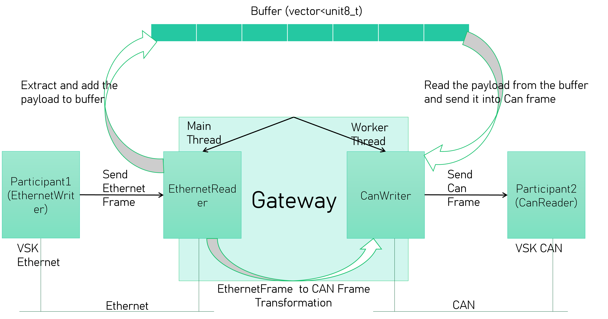

# Overview

This README provides an overview of how to use the SilKit demo applications for communication across CAN, Ethernet, and Gateway protocols. The demo applications include:

- **Registry**
- **EthernetWriter**
- **CanReader**
- **Gateway**

Each of these components can be run using a `.yaml` configuration file, and they support asynchronous operation with the `--async` flag.

---
# Application Architecture




## 1. Registry

### Description:
The `SilKit Registry` is a central registry for managing and registering different SilKit components. It is used to coordinate communication between various applications.

### Command to run:
```bash
./GatewayApplication2/executables/sil-kit-registry
```

Make sure that the registry is running before starting other components.

---

## 2. EthernetWriter

### Description:
The `EthernetWriter` demo application simulates an Ethernet bus writer. It reads from a `.yaml` configuration file and transmits Ethernet messages to the bus.

### Command to run:
```bash
./GatewayApplication2/executables/EthernetWriter GatewayApplication/Demo.silkit.yaml --async
```

This command runs the `EthernetWriter` in asynchronous mode, where it will continuously send Ethernet messages based on the configuration specified in `Demo.silkit.yaml`.

---

## 3. CanReader

### Description:
The `CanReader` demo application simulates reading data Sent from the Gateway application. It processes incoming messages based on the provided `.yaml` configuration.

### Command to run:
```bash
./GatewayApplication2/executables/CanReader GatewayApplication/Demo.silkit.yaml --async
```

This command runs the `CanReader` in asynchronous mode, continuously reading Can messages coming from the Gateway application according to the configuration specified in `Demo.silkit.yaml`.

---

## 4. Gateway

### Description:
The `Gateway` application bridges communication between CAN and Ethernet networks. It allows for seamless data transfer between these two protocols.

### Command to run:
```bash
./GatewayApplication2/executables/Gateway GatewayApplication/Demo.silkit.yaml --async
```

This command runs the `Gateway` in asynchronous mode, facilitating communication between EthernetWriter and CanReader, based on the configuration specified in `Demo.silkit.yaml`.

---

## Configuration File (`Demo.silkit.yaml`)

The `.yaml` configuration file should specify the parameters for each application, including network settings, transport layers, and other required configurations. It must be structured in a format that is compatible with SilKit.

---

## Running the Demo Applications

1. **Start the Registry**: First, ensure the registry is running by executing the command for the `SilKit Registry`.
2. **Start the EthernetWriter**: After the registry is up and running, execute the `EthernetWriter` command to send messages via Ethernet.
3. **Start the CanReader**: Run the `CanReader` to start receiving Can messages.
4. **Start the Gateway**: Finally, launch the `Gateway` application to enable communication between CAN and Ethernet networks.

---

## Notes

- Ensure that your environment is properly configured for SilKit applications.
- All applications are run in asynchronous mode with the `--async` flag to allow for continuous operations.
- The `Demo.silkit.yaml` file must be adjusted to match your specific network configuration and settings.

---

This README provides the basic steps to get started with the SilKit demo applications. For more advanced usage or troubleshooting, refer to the SilKit documentation.

---

## 📬 Contact

Author: Aymen Besbes

Email: Aymen.besbes@outlook.com | Aymen.besbes@ensi-uma.tn

LinkedIn: https://www.linkedin.com/in/aymen-besbes-158837245/
