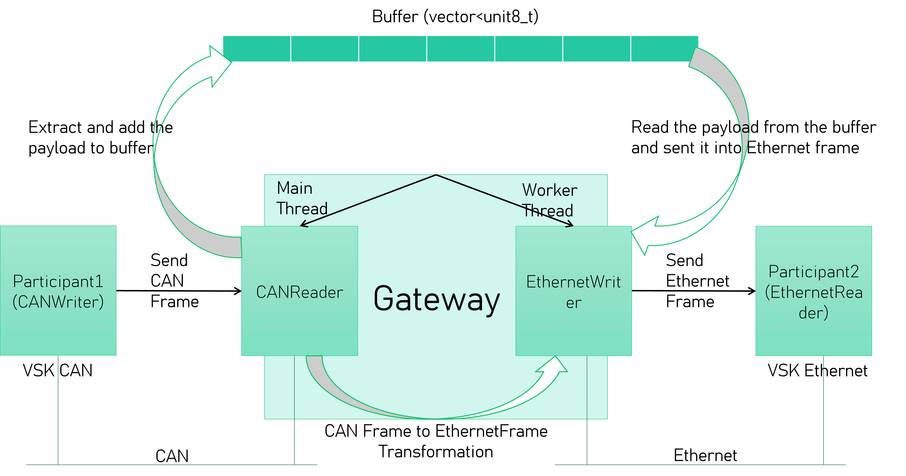

# Vector SIL Kit - Release Version 4.0.50

This repository contains the release bundle for **Vector SIL Kit 4.0.50**, which provides an ecosystem for simulating distributed systems with components like CAN, Ethernet, and LIN. This release includes binaries, demos, documentation, source code, and additional application examples.

---

## 📁 Repository Layout

## 📁 Directory Structure

```text
├── GatewayApplication/          # Custom application: CAN → Ethernet gateway
│
├── GatewayApplication2/         # Custom application: Ethernet → CAN gateway
│
├── SampleSilKit/                # Sample SIL Kit usage examples
│
├── SilKit/                      # the binary Vector SIL Kit release including the object files, the C++ interface headers and CMake exported targets.
│
├── SilKit-Demos/                # SIL Kit Demos in source form. The demos are preconfigured to use the pre-built binary distribution of the SilKit/  │                                directory.
│
├── SilKit-Documentation/        # HTML and text-based documentation
│
├── SilKit-Source/               # Documentation in HTML and text format.
│
└── README.md                    # This file

```
---

## 🧩 Custom Gateway Applications

### 🔌 GatewayApplication/
A demo application that **receives CAN frames from a `CanWriter`** and **forwards them as Ethernet frames to an `EthernetReader`**.

- 📄 [View detailed GatewayApplication README.md](./GatewayApplication/ReadMe.md)
- 🗂 Architecture Diagram:

  

---

### 🌐 GatewayApplication2/
A demo application that **receives Ethernet frames from an `EthernetWriter`** and **converts them into CAN frames sent to a `CanReader`**.

- 📄 [View detailed GatewayApplication2 README.md](./GatewayApplication2/ReadMe.md)
- 🗂 Architecture Diagram:

  

---
---

## 📬 Contact
Author: Aymen Besbes

Email: Aymen.besbes@outlook.com | Aymen.besbes@ensi-uma.tn

LinkedIn: https://www.linkedin.com/in/aymen-besbes-158837245/
